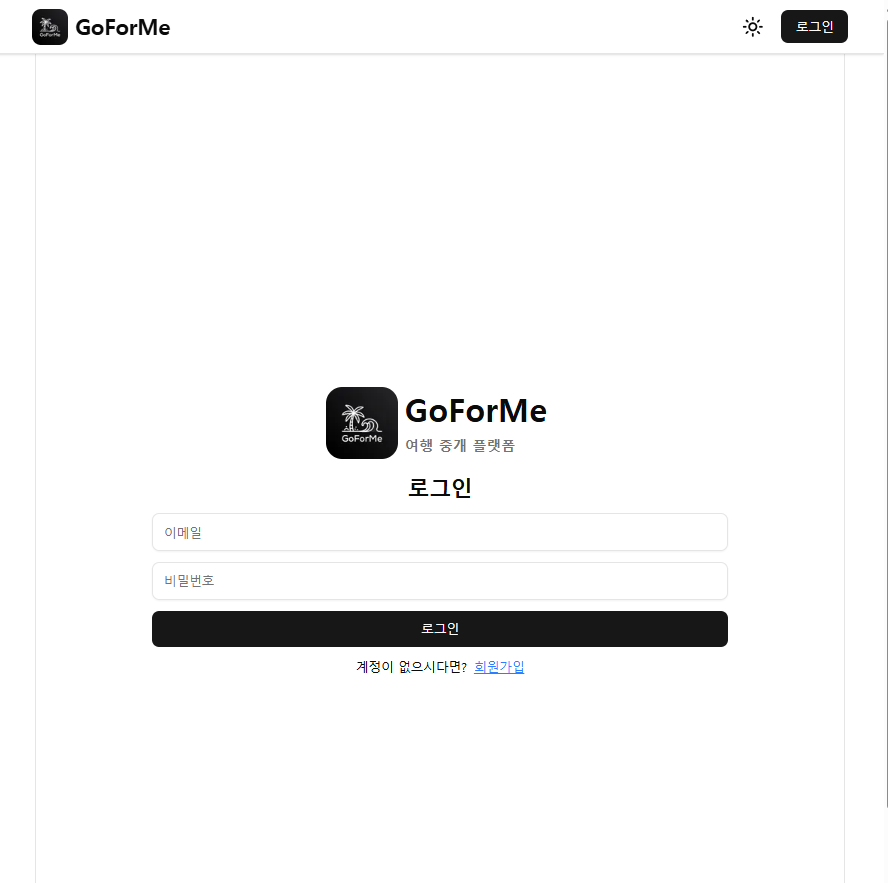
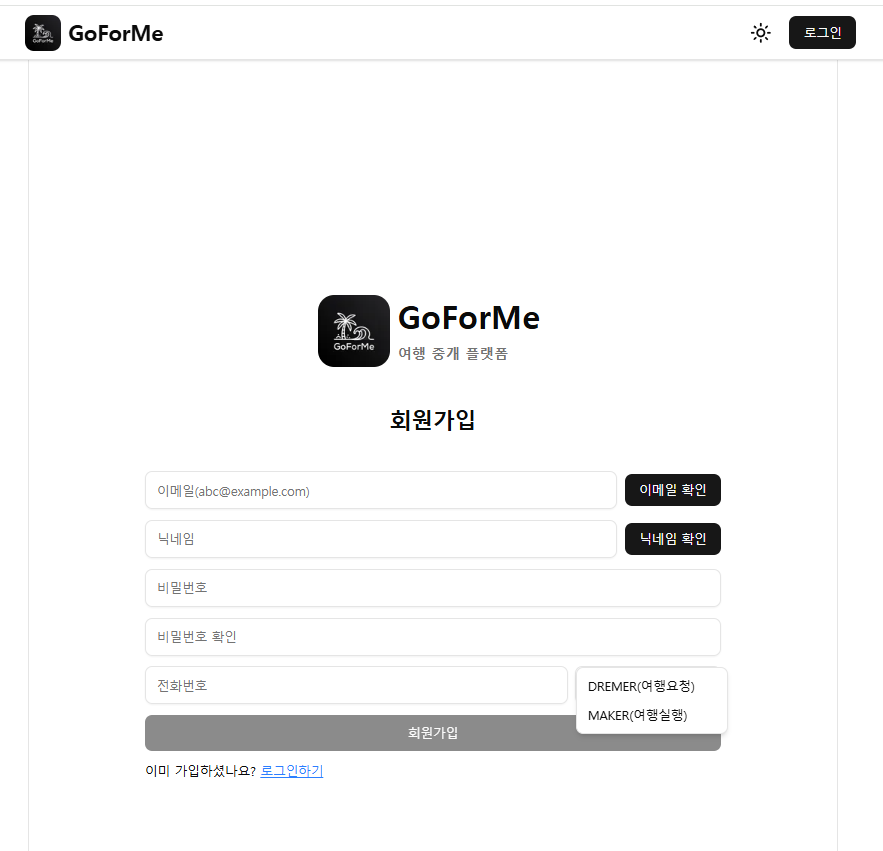
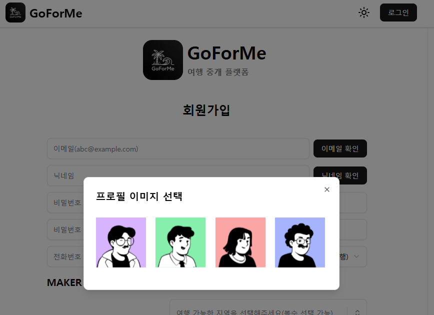

## 프로젝트 소개

여행을 대신해 준다는 컨셉의 플랫폼 입니다.  
여행을 의뢰하는 사용자(Dreamer)와 여행을 대신해 줄 사용자(Maker)가
여행 플랜을 등록·조회하고, 견적을 주고받을 수 있는 기능을 제공합니다.

---

## 개발 참여자
- 방신철 (개인프로젝트)

## 페이지 스크린샷

<table>
  <tr>
    <td align="center">
      <br />
      <sub>로그인 화면</sub>
    </td>
    <td align="center">
      <br />
      <sub>회원가입 화면</sub>
    </td>
    <td align="center">
      <br />
      <sub>드리머 역할 선택 회원가입</sub>
    </td>
  </tr>
  <tr>
    <td align="center">
      <br />
      <sub>프로필 이미지 선택</sub>
    </td>
    <td align="center">
      <br />
      <sub>이미지 선택 예시</sub>
    </td>
    <td align="center">
      <br />
      <sub>메이커 역할 선택 회원가입</sub>
    </td>
  </tr>
  <tr>
    <td align="center">
      <br />
      <sub>서비스 지역 선택</sub>
    </td>
    <td align="center">
      <br />
      <sub>서비스 유형 선택</sub>
    </td>
    <td align="center">
      <br />
      <sub>메이커 목록</sub>
    </td>
  </tr>
  <tr>
    <td align="center">
      <br />
      <sub>메이커 견적 보내기</sub>
    </td>
    <td align="center">
      <br />
      <sub>드리머 목록</sub>
    </td>
    <td align="center">
      <br />
      <sub>드리머 상세</sub>
    </td>
  </tr>
</table>

## 기술 스택

- **Framework**: Next.js (App Router)
- **Language**: TypeScript
- **Data Fetching / Caching**: React Query
- **State Management**: Zustand
- **Styling**: (실제 사용한 스타일링 방식 적기: 예) Tailwind CSS, CSS Modules 등)
- **Auth**: JWT 기반 토큰, 자동 토큰 갱신
- **Build / Deploy**: (사용했다면) Vercel

---

## 주요 기능

- **역할 기반 화면**
  - 로그인한 사용자의 역할(Dreamer / Maker)에 따라 다른 메뉴와 화면을 제공합니다.
  - 게스트 전용 / 회원 전용 레이아웃을 분리해, 접근 권한에 따라 화면 구성을 다르게 했습니다.

- **여행 플랜 관리**
  - Dreamer가 여행 플랜을 등록하고, 받은 견적 목록과 상세 내용을 확인할 수 있습니다.
  - 무한 스크롤을 통해 스크롤만으로 이전 플랜들을 계속 조회할 수 있습니다.

- **견적 제안 및 확인**
  - Maker는 받은 요청 목록을 확인하고, 각 요청에 대한 견적을 작성·수정할 수 있습니다.
  - Dreamer는 요청별로 여러 견적을 비교하고, 선택·관리할 수 있습니다.

- **무한 스크롤 리스트**
  - 요청/플랜/견적 목록에 무한 스크롤을 적용해, 페이지 번호를 클릭하지 않고도 스크롤만으로 계속 탐색할 수 있습니다.
  - 다음 페이지 데이터는 미리 불러오고, 기존 데이터는 유지해 스크롤 시 깜빡임을 줄였습니다.

---

## 개발 시 신경 쓴 점

- **중복 API 요청 제거와 빠른 화면 전환**
  - 사용자의 이용 흐름(유저 플로우)인 ‘목록 → 상세 페이지 이동’ 과정에서, 이미 받은 데이터를 다시 서버에 요청해 로딩이 반복되는 문제를 발견했습니다.
  - React Query 캐시 키를 목록용(아이디 배열)과 상세용(개별 데이터)으로 분리하고, 목록 조회 시 개별 아이템을 미리 캐시에 저장해, 상세 페이지 진입 시 서버 요청 없이 바로 화면을 표시하도록 개선했습니다.

- **전역 상태 관리 패턴 정리(Zustand)**
  - 세션, 모달, 폼 상태를 페이지마다 따로 관리하면 상태 흐름을 따라가기 어렵다고 느껴, Zustand로 전역 상태를 통합 관리했습니다.
  - 상태와 액션을 분리하고, 필요한 조각만 구독하는 커스텀 훅 패턴을 사용해 불필요한 리렌더링을 줄이려 했습니다.

- **토큰 만료 시 사용자 경험 개선**
  - 사용자가 견적 작성 중 토큰이 만료되면 갑자기 로그인 페이지로 이동하면서 작성 내용이 사라지는 문제가 있었습니다.
  - 토큰 만료(401)를 감지해 자동으로 토큰을 갱신하고, 원래 요청을 한 번 더 시도하는 흐름을 추가해, 갑작스러운 로그아웃과 데이터 유실을 줄였습니다.

- **App Router 구조를 활용한 역할·접근 제어**
  - 기존 Pages Router 프로젝트에서 폴더 구조와 인증 분기가 복잡하다고 느껴, 이번 프로젝트에서는 App Router의 라우트 그룹과 레이아웃을 적극적으로 사용했습니다.
  - 게스트 전용 / 회원 전용 / 역할별(Dreamer / Maker) 레이아웃을 분리해, 인증 및 접근 제어 로직을 각 레이아웃에 배치하고, 페이지 컴포넌트는 화면 표현에 집중할 수 있도록 구성했습니다.

### 파일구조

```
goforme-approutev
├─ .prettierrc
├─ components.json
├─ eslint.config.mjs
├─ next.config.ts
├─ package-lock.json
├─ package.json
├─ postcss.config.mjs
├─ public
├─ README.md
├─ src
│  ├─ api
│  │  ├─ auth.ts
│  │  ├─ plan-post.ts
│  │  └─ profile.ts
│  ├─ app
│  │  ├─ (guestonly)
│  │  │  ├─ layout.tsx
│  │  │  ├─ login
│  │  │  │  ├─ error.tsx
│  │  │  │  └─ page.tsx
│  │  │  └─ signup
│  │  │     ├─ error.tsx
│  │  │     └─ page.tsx
│  │  ├─ (member-only)
│  │  │  ├─ dreamer-plan
│  │  │  │  ├─ estimates
│  │  │  │  │  └─ [id]
│  │  │  │  │     └─ page.tsx
│  │  │  │  └─ page.tsx
│  │  │  ├─ layout.tsx
│  │  │  └─ maker-plan
│  │  │     ├─ error.tsx
│  │  │     └─ page.tsx
│  │  ├─ actions
│  │  │  └─ auth-actions.ts
│  │  ├─ favicon.ico
│  │  ├─ globals.css
│  │  ├─ layout.tsx
│  │  ├─ not-found.tsx
│  │  └─ page.tsx
│  ├─ assets
│  │  ├─ icon_default.svg
│  │  ├─ icon_default_profile.svg
│  │  ├─ icon_loading.png
│  │  ├─ icon_logo_img3.jpg
│  │  ├─ img_avatar1.svg
│  │  ├─ img_avatar2.svg
│  │  ├─ img_avatar3.svg
│  │  ├─ img_avatar4.svg
│  │  └─ logo_img2.png
│  ├─ components
│  │  ├─ Gnb
│  │  │  ├─ global-layout.tsx
│  │  │  └─ header
│  │  │     └─ profile-button.tsx
│  │  ├─ modal
│  │  │  ├─ editor-modal.tsx
│  │  │  ├─ estimate-modal.tsx
│  │  │  └─ image-select-modal.tsx
│  │  ├─ post
│  │  │  ├─ dreamer
│  │  │  │  ├─ dreamer-plan-post.tsx
│  │  │  │  └─ received-estimate.tsx
│  │  │  ├─ estimate.tsx
│  │  │  └─ maker
│  │  │     └─ plan-item.tsx
│  │  ├─ profile
│  │  │  ├─ dreamer-profile.tsx
│  │  │  └─ maker-profile.tsx
│  │  ├─ quotation
│  │  │  ├─ estimate-info-item.tsx
│  │  │  ├─ estimate-info.tsx
│  │  │  └─ plan-info.tsx
│  │  └─ ui
│  │     ├─ alert-dialog.tsx
│  │     ├─ badge.tsx
│  │     ├─ button.tsx
│  │     ├─ carousel.tsx
│  │     ├─ command.tsx
│  │     ├─ dialog.tsx
│  │     ├─ fallback.tsx
│  │     ├─ global-loader.tsx
│  │     ├─ input.tsx
│  │     ├─ loader.tsx
│  │     ├─ multi-select.tsx
│  │     ├─ popover.tsx
│  │     ├─ role-selector.tsx
│  │     ├─ select.tsx
│  │     ├─ skeleton.tsx
│  │     ├─ sonner.tsx
│  │     ├─ textarea.tsx
│  │     └─ trip-plan.tsx
│  ├─ hooks
│  │  ├─ mutations
│  │  │  ├─ use-estimate.ts
│  │  │  ├─ use-login.ts
│  │  │  └─ use-sign-up.ts
│  │  └─ queries
│  │     ├─ use-infinity-dreamer-plan-data.ts
│  │     ├─ use-infinity-maker-plan-data.ts
│  │     ├─ use-infinity-quotation-by-id-data.ts
│  │     ├─ use-plan-post-by-id-data.ts
│  │     ├─ use-profile-data.ts
│  │     └─ use-quotation-by-id-data.ts
│  ├─ lib
│  │  ├─ constants.ts
│  │  ├─ fetch-with-auth.ts
│  │  ├─ query-builder.ts
│  │  ├─ time.ts
│  │  ├─ token-exp.ts
│  │  ├─ utils.ts
│  │  └─ validate.ts
│  ├─ provider
│  │  ├─ modal-provider.tsx
│  │  ├─ react-query-provider.tsx
│  │  └─ session-provider.tsx
│  ├─ store
│  │  ├─ editor-modal.ts
│  │  ├─ session.ts
│  │  ├─ sign-up.ts
│  │  └─ trip-plan-select.ts
│  └─ types.ts
└─ tsconfig.json

```
